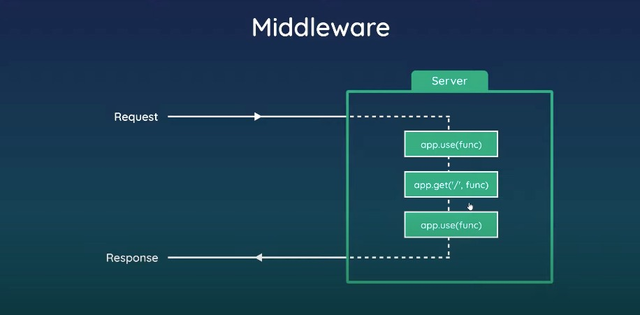
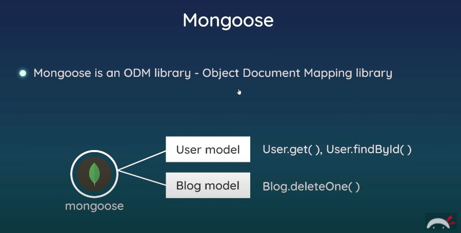
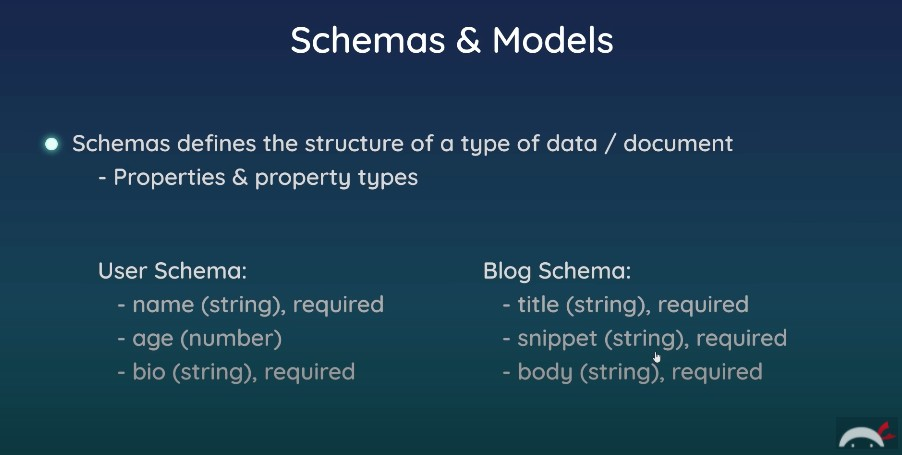
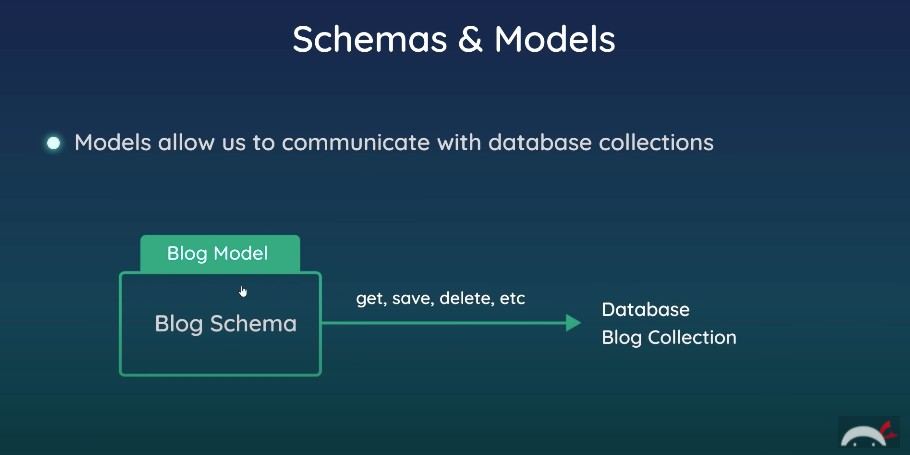
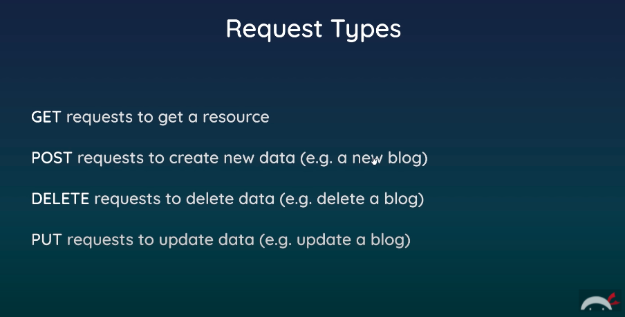
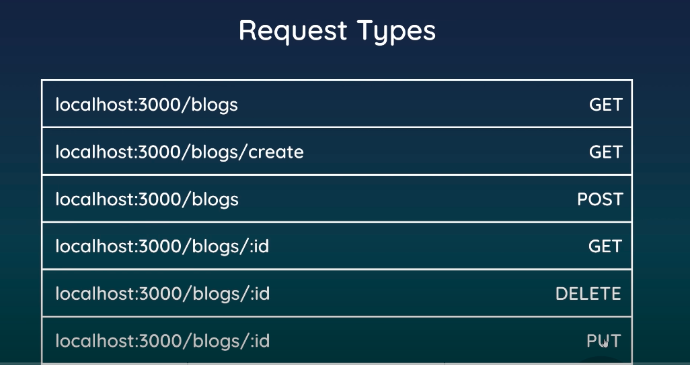
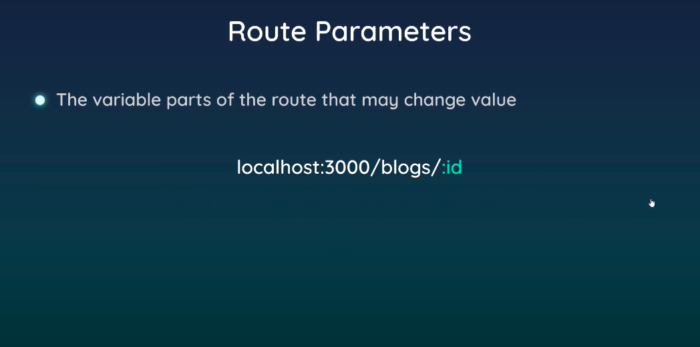

**Node**.js Crash Course
===

## This is my own hands-on exercise of the [Node.js Crash Course tutorial series](https://www.youtube.com/watch?v=zb3Qk8SG5Ms&list=RDCMUCW5YeuERMmlnqo4oq8vwUpg&start_radio=1) on The Net Ninja YouTube Channel.
## At the end of the tutorial series. We'll create a blog website using Node.js, express.js, MongoDB.

[Chapter 01 --- Introduction & Setup](https://www.youtube.com/watch?v=zb3Qk8SG5Ms&t=2s)
---
- What is Node.js?
- What you will learn?
- Installing Node.js
- Running files through Node.js

[Chapter 02 --- Node.js Basics](https://www.youtube.com/watch?v=OIBIXYLJjsI) on [ch02](https://github.com/Hans-Tsai/Node.js-crash-course/tree/ch02)
---
- Node.js basics
- the `global` object
- modules & `require()`
- `Filesystem` core module
- `Stream` & `Buffer` core modules

[Chapter 03 --- Client & Server](https://www.youtube.com/watch?v=-HPZ1leCV8k) on [ch03](https://github.com/Hans-Tsai/Node.js-crash-course/tree/ch03)
---
- client & server
- IP addresses & domain
- `HTTP` core module --- creating a server
- `localhost` & port numbers

[Chapter 04 --- Requests & Responses](https://www.youtube.com/watch?v=DQD00NAUPNk) on [ch04](https://github.com/Hans-Tsai/Node.js-crash-course/tree/ch04)
---
- `request` object
- `response` object
- returning HTML pages
- basic routing
- status codes
- redirects

[Chapter 05 --- `npm`](https://www.youtube.com/watch?v=bdHE2wHT-gQ) on [ch05](https://github.com/Hans-Tsai/Node.js-crash-course/tree/ch05)
---
- third party packages
- install packages globally (e.g. `nodemon`)
- the `package.json` file & installing packages locally
- dependencies & sharing code

[Chapter 06 --- Express app](https://www.youtube.com/watch?v=Lr9WUkeYSA8) on [ch06](https://github.com/Hans-Tsai/Node.js-crash-course/tree/ch06)
---
- What is `express`?
- creating an `express` app
- routing & html pages
- redirects & 404 page

[Chapter 07 --- View Engines](https://www.youtube.com/watch?v=yXEesONd_54) on [ch07](https://github.com/Hans-Tsai/Node.js-crash-course/tree/ch07)
---
- view engines at a glance
- `ejs` view engine
- passing data into views
- partials
- adding css

[Chapter 08 --- Middleware Function](https://www.youtube.com/watch?v=_GJKAs7A0_4) on [ch08](https://github.com/Hans-Tsai/Node.js-crash-course/tree/ch08)
---
- what is middleware function?
  + code which runs (on the server) between getting a request and sending a response
  + 
  + examples
    * logger middleware to log details of every request
    * Authentication check middleware for protected routes
    * Middleware to parse JSON data from requests
    * Return 404 pages
  + Reference by express.js official documentation: [Writing middleware for use in Express apps](https://expressjs.com/en/guide/writing-middleware.html)
- using `next()`
- 3rd party middleware function
- static files

[Chapter 09 --- MongoDB & Mongoose.js ODM library](https://www.youtube.com/watch?v=bxsemcrY4gQ&t=12s) on [ch09](https://github.com/Hans-Tsai/Node.js-crash-course/tree/ch09)
---
- introduction to Mongodb
- Mongodb setup with Atlas
- `Mongoose.js` ODM library
  + 
  + 
  + 
- getting & saving data
- outputting documents in views

[Chapter 10 --- `GET`、`POST`、`DELETE` requests](https://www.youtube.com/watch?v=VVGgacjzc2Y) on [ch10](https://github.com/Hans-Tsai/Node.js-crash-course/tree/ch10)
---
- request types
  + `GET`: requests to get a resource
  + `POST`: requests to create a new data (e.g. create a new blog)
  + `DELETE`: requests to delete a data (e.g. delete a blog)
  + `PUT`: requests to update a data (e.g. update a blog)
  + 
  + Exercise in this `ch10` branch
    * 
- `POST` requests
- route parameters
  + The variable parts of the route that may change value.
    * e.g. localhost:3000/blogs/:id
  + 
- `DELETE` requests